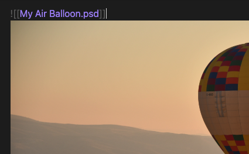
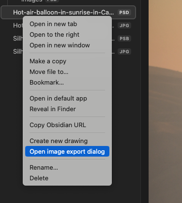
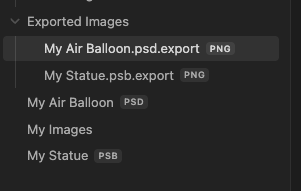

# Obsidian Image Magician Plugin

This plugin for Obsidian (https://obsidian.md) supports various image formats
not natively supported by the Obsidian app.

With this plugin, you can use various features based on images,
such as preview, link, embed, and export to other image formats like png, jpg, and webp.

This project mainly utilizes [magick-wasm](https://github.com/dlemstra/magick-wasm) to offer rendering and export features.
Especially, a dedicated engine [@webtoon/psd](https://github.com/webtoon/psd) is ready for the psd (Photoshop) format.

## Support

If you find this plugin helpful, please consider supporting the project.

## Key Features

### Dedicated view

Preview various image formats in Obsidian without a third-party app, such as PSD for Photoshop and over 100 formats powered by ImageMagick.

### Natural markdown support like obsidian native images

Markdown inline link syntax is supported, such as `![[My Image.psd]]`.
Also, HTML `` tag is supported.

### Enhanced path detection in ``

This feature works for all `` tags, including Obsidian's native image formats like png, jpg, and webp

You can insert either a vault-based path or an inline link in the img tag. For example:

-   ``
-   ``

`" />

### Export Dialog

You can promptly export specific images through the context menu or a command, resize option is supported.

### Auto Export

The plugin features an auto-export functionality that triggers when the source file undergoes changes, determined by the file's modified date. You can customize the options in Plugin's Settings.

## Installation

### Manually Installing the Plugin

-   Create a plugin folder in your vault at `VaultFolder/.obsidian/plugins/image-magician`.
-   Download the latest release and copy over `main.js`, `styles.css`, and `manifest.json` into the folder.

### From the Community Plugins List

Search and install "Image Magician" in Obsidian's community plugins browser, then enable the plugin.

## Image formats

You can try with any known image formats that see through the plugin settings.
However, the plugin not guarantee it is works.

### Default listed formats in plugin

Here the list below that registered as default supported formats in plugin.

| Format          | Note                                                              |
| --------------- | ----------------------------------------------------------------- |
| PSD             | Photoshop.                                                        |
| PSB             | Photoshop (large format).                                         |
| TIFF,TIF,TIFF64 |                                                                   |
| DCM             |                                                                   |
| DDS             |                                                                   |
| HDR             |                                                                   |
| HEIC            |                                                                   |
| MNG             |                                                                   |
| PBM             |                                                                   |
| PCX             |                                                                   |
| PFM             |                                                                   |
| PGM             |                                                                   |
| PNM             |                                                                   |
| PPM             |                                                                   |
| SGI             |                                                                   |
| XBM             |                                                                   |
| XCF             | Gimp image. However, as I confirmed, it renders only single layer |

### Excludes: These are basically handled in obsidian

| Format | Note                 |
| ------ | -------------------- |
| PNG    |                      |
| JPG    |                      |
| WEBP   |                      |
| GIF    |                      |
| SVG    |                      |
| BMP    |                      |
| AVIF   | Since obsidian 1.5.3 |

### Seems Broken in ImageMagick

These are listed on Image Magick library. But not works.

| Format | Note                           |
| ------ | ------------------------------ |
| TGA    | Truevision Targa image         |
| SVG    | Required inkscape command line |

## Known problems and Tips

### Rendering problems with export markdown as another format

If you plan to export your markdown to another format or encounter rendering problems, it is recommended to change the 'Render Mode' option to 'Data URL'.

### Link suggestion

This issue (or the intended behavior in Obsidian) has been identified in at least Obsidian 1.5.0. You may not see link suggestions when embedding non-obsidian-native images that are not default supported in Obsidian. You can resolve this by turning on 'Settings > File & Links > Detect all file extensions.' Alternatively, you can use a plugin such as [Boost Link Suggestions](https://github.com/jglev/obsidian-boost-link-suggestions).

## Format list in image-magick

The document of image-magick, there are listed various formats (100+),
but as I confirmed some of formats has been incomplete drawing or throw errors.
Therefore, I listed some of formats as default plugin supported that I confirmed that is renders as expected.

[Dump: Supported formats in Image Magick](./docs/ImageMagick_dump.md)
